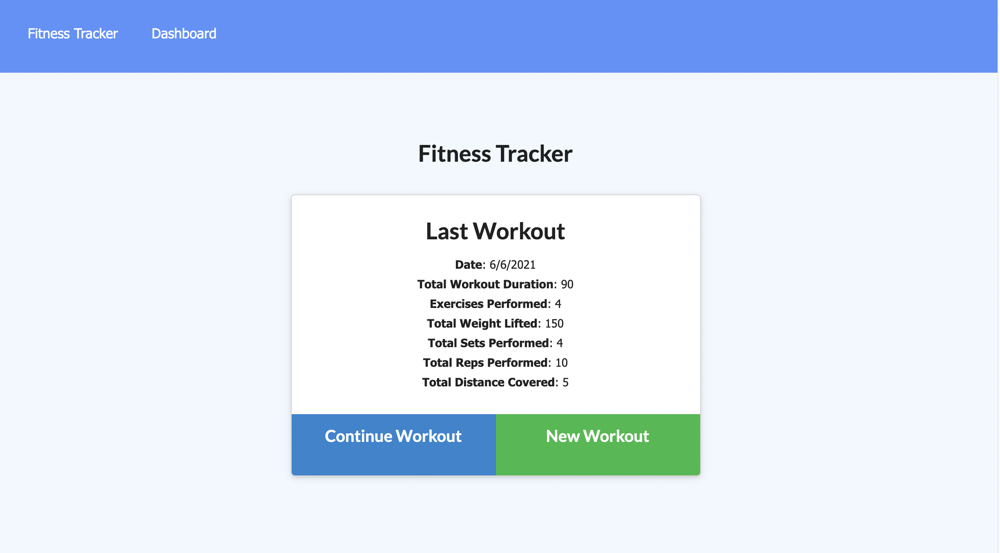
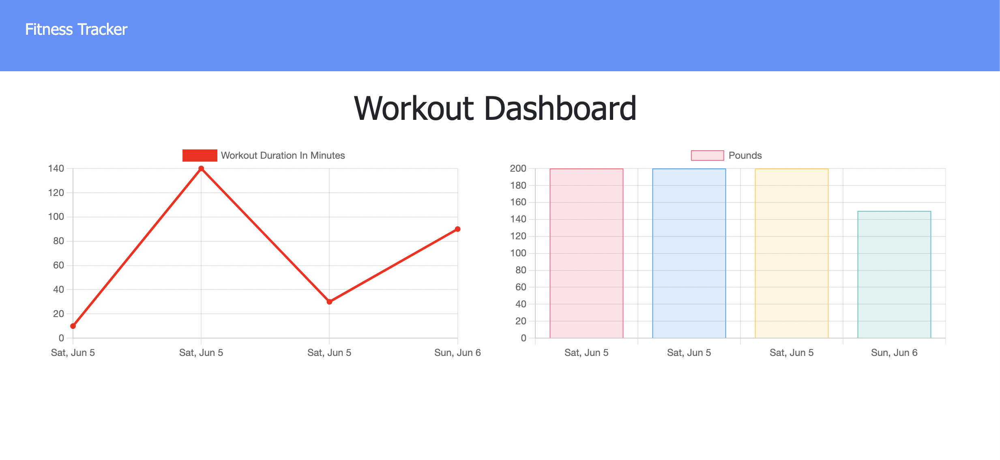

# Workout-Tracker

## User Story

As a user, I want to be able to view create and track daily workouts. I want to be able to log multiple exercises in a workout on a given day. I should also be able to track the name, type, weight, sets, reps, and duration of exercise. If the exercise is a cardio exercise, I should be able to track my distance traveled.

# Technology
* Mongo DB
* Heroku
* Javascript
* Node 
* Robo 3T

# Challenges
Upon deployment with Heroku and Mongo Atlas DB, I noticed the website does not work.  I will work this out with tutor or in office hours.  The application does work on my local server.

# Repository
* https://github.com/Vinyl77/workout-tracker
* https://safe-tundra-17882.herokuapp.com/
